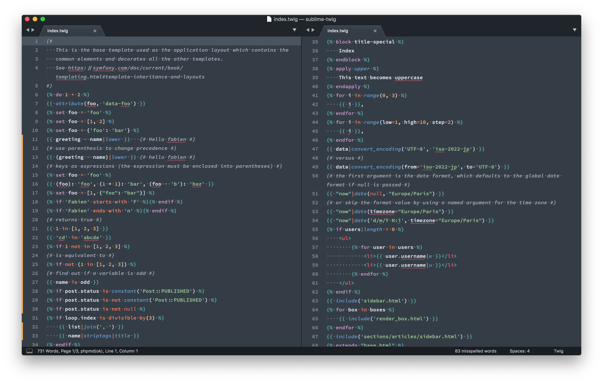

# Twig Sublime

> A collection of syntaxes and completions for Twig templates

### Why?

*How is this different from [Anomareh/PHP-Twig.tmbundle](https://github.com/Anomareh/PHP-Twig.tmbundle)?*

- Better highlighting, overall
- More completions (eventually)
- Uses native Sublime syntax highlighting, not Textmate bundle conversion

### Usage

*With Git*

- `cd $HOME/Library/Application\ Support/Sublime\ Text\ 3/Packages`
- `git clone https://github.com/james2doyle/sublime-twig`

*With Package Control*

- "Package Control > Add Repository"
- https://github.com/james2doyle/sublime-twig
- "Package Control > Install Package"
- Install "sublime-twig" package

### TODOs

- [x] comments
- [x] tag completions
- [x] filter completions
- [x] function completions
- [x] test completions
